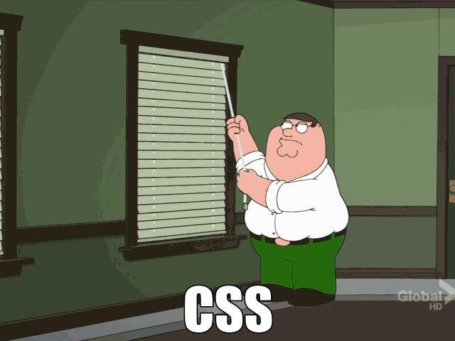
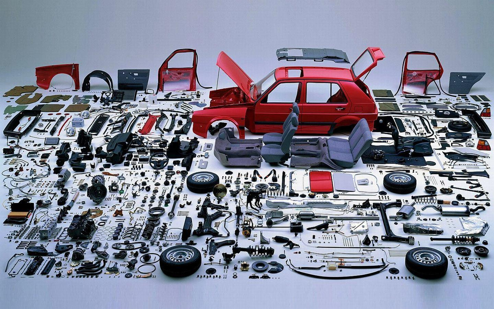
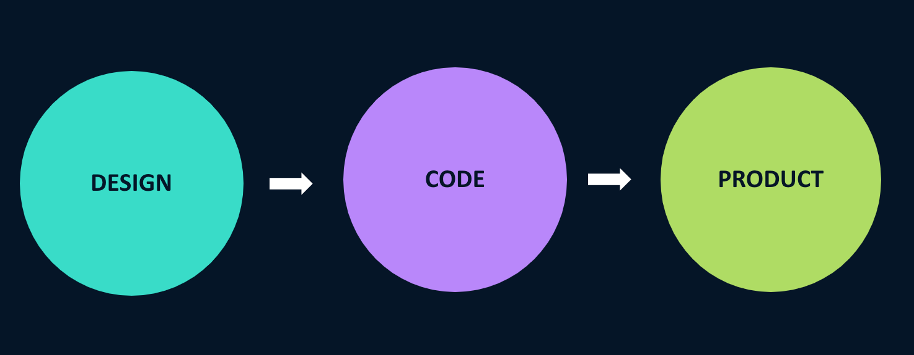
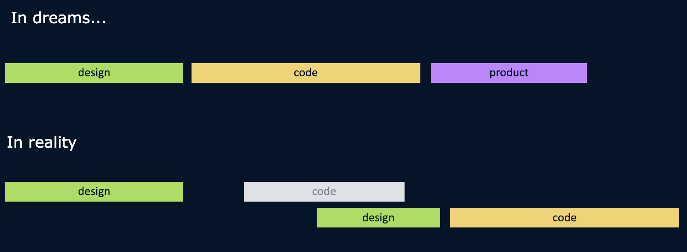
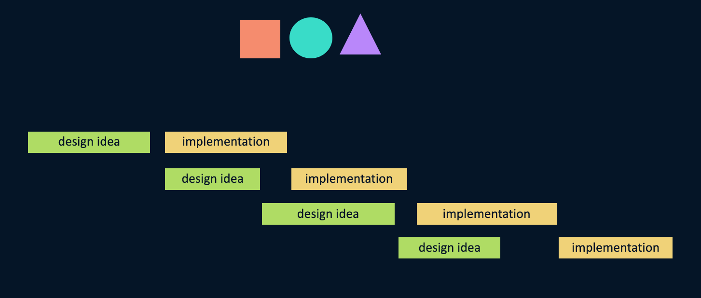
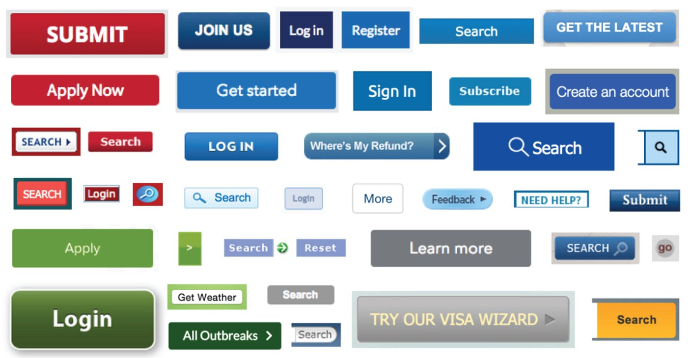
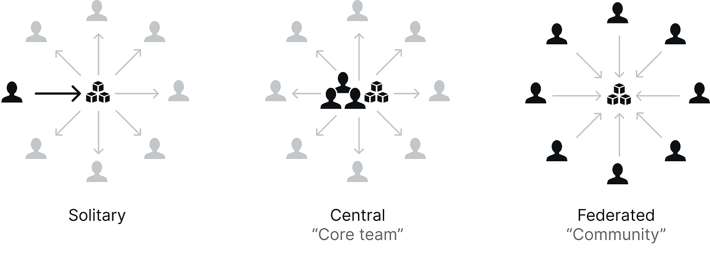
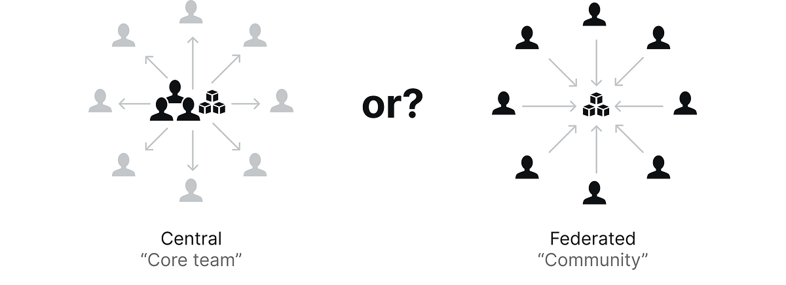
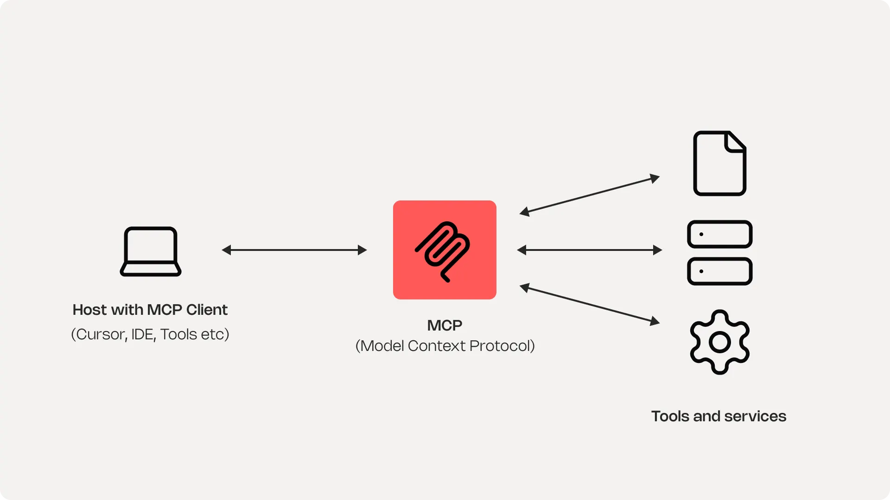

<!-- Source: /Users/varya/WebDev/Talks/design-and-develop-ui-2025/index.mdx -->

<!-- .slide: class="cover" -->

aalto university

<h1 class="cover-title">Designing and  Developing UI in 2026</h1>

From CSS scale pain to design systems, and why AI makes the system even more necessary.

<strong>Varya Stepanova</strong> &nbsp;·&nbsp; 30 September 2026

---

<!-- .slide: class="about-me" -->

### Varya Stepanova

<strong>Design Systems Architect</strong> 
<small>engineering manager, frontend architect, independent consultant</small>

#### Contacts

  <a href="https://bridge-the-gap.dev/" target="_blank" rel="noopener noreferrer"><svg class="btg-icon" xmlns="http://www.w3.org/2000/svg" viewBox="0 0 47.13 24.412" fill="currentColor" aria-hidden="true"><path d="M0 0h47.13v24.412h-6.024v-9.54c0-6.262-2.582-9.64-7.445-9.64h-.067c-4.862 0-7.411 3.444-7.411 10.136v9.044h-6.358v-7.527c0-6.162-2.548-9.474-7.11-9.474h-.066c-4.192 0-6.54 2.948-6.54 8.017v8.984H0z"/></svg>Bridge-the-Gap.dev</a>
  <a href="https://www.linkedin.com/in/varyastepanova/" target="_blank" rel="noopener noreferrer"><i class="fa-brands fa-linkedin-in" aria-hidden="true"></i>linkedin.com/in/varyastepanova</a>
  <a href="https://varya.me" target="_blank" rel="noopener noreferrer"><i class="fa-solid fa-globe" aria-hidden="true"></i>varya.me</a>

designing and developing ui in 2026Who I am

Note:
Hello, my name is Varya. I\'m a software engineer by trade. Particularly, my focus has always been on frontend development. And I always worked producing user interfaces as an engineer myself, manager for other engineers, and at the moment I\'m working as an independent consultant at my own agency. So with this lecture, I would like to bring you an industry perspective on how to develop user interfaces in 2026.

I started with libraries of components about 15 years ago, before the term "design systems" even emerged. By that time, my own understanding and the community\'s was more technical. We were paying a lot of attention to how to code the components, how to document them. Slightly by today, I changed my focus to more process and people oriented. I realised that the biggest obstacle on the way is the gap between specialists: designers and developers, product people and business people. In the meanwhile I got a design education that helped me to see the picture at scale. Nowadays, even though I am still doing a lot of hands-on and architectural frontend work related to the design systems, I shift to engineering & project management, educating, and engaging people.
---

<!-- ========== LECTURE PATH (2026-09-22 flow) ========== -->
<!-- High-level slides on X. A vertical exists only when that slide is already written. -->
<!-- Planning for the other verticals is in Note: blocks. Archive of older slides stays below the blank separator. -->

Summary

  

    <a class="tier" href="#/scale">
      01 · Scale
      Why large UI projects break
    </a>
    <a class="tier t2" href="#/components">
      02 · Components
      Solving problems just once
    </a>
    <a class="tier" href="#/system">
      03 · System
      From a pile of parts to a design system
    </a>
    <a class="tier t2" href="#/work">
      04 · The work
      Component APIs and breaking changes
    </a>
  

  

    <a class="tier" href="#/governance">
      05 · Governance
      Teams and adoption
    </a>
    <a class="tier t2" href="#/price">
      06 · The price
      What you tell the people who fund it
    </a>
    <a class="tier" href="#/ai">
      07 · AI
      Produce UI, and make the system usable
    </a>
    <a class="tier t3" href="#/study">
      08 · Study
      Technologies and concepts
    </a>
  

designing and developing ui in 2026Summary

Note:
Here is what we are going to go through. I will explain the properties of large UI projects, and then what are the solutions the industry came up with. The largest part of the lecture is design systems because this is the major solution to many UI problems, particularly problems of UI production at scale. I will walk you through different things of design systems: planning and creating components, governing the system itself, operating on a business level when you are speaking to business stakeholders, and we will of course touch AI\'s role in the process.

Say the spine in one breath: the tools were built for a smaller job, components are how we divide the work, a system is more than the library, designers and engineers share one interface, who is allowed to make it, what it costs, what AI changes, and what to study.
---

<!-- .slide: id="scale" -->

Scale

  

    CSS, 1996
    
A way to make text bold and links underlined. We now build interfaces with it.

  

  

    JavaScript
    
A powerful language, with real constraints once the interface is shared.

  

  

    The mismatch
    
Design hands over a picture. Engineering has to make it run. The business wants it fast. There was no reliable way to scale that.

  

  
the tools were built for different jobs

designing and developing ui in 2026Scale

Note:
Basically, what makes producing UI interfaces in the industry special is scale. And that makes us choose different solutions than we would choose for, say, our cats\' homepages. Why is scale such a problem? The thing is that to draw the UI in the browser, we are using technologies that were not designed for that.

For example, we are using CSS, which is nowadays a 30-year-old technology. And it hasn\'t changed much since then. In previous lectures, I showed a piece of CSS from its very first specification, which is still a valid piece of code and can be interpreted by browsers. Basically, CSS was created to make texts bold and align them to the left or right. But nowadays we are using it for really complex interfaces.

Similar things can be said about JavaScript, even though it\'s a bit more advanced. In JavaScript, we were supposed to operate with the DOM tree, but it turned out to be not very convenient, especially when we are working on very complex web interfaces with a lot of custom UIs. The DOM is one shared tree, listeners and state pile up, and people become afraid to change a line because they cannot see what else moves.

And the last challenge listed on the slide is the mismatch in what the product and design part of the company does with what engineers need to produce. Design and product people often tend to think in views or pictures, then engineers need a very different system behind what they are building. There was no reliable way to scale that.
>>>

<figure class="meme">
  
  <figcaption>a lot of memes about css</figcaption>
</figure>

designing and developing ui in 2026Scale

Note:
Speaking about CSS, there are a lot of memes. This funny picture very much speaks about how the intention of people who write CSS doesn\'t match reality.
>>>

  

    
    
<s>CSS</s> UI production

  

designing and developing ui in 2026Scale

Note:
This animation with Family Guy was often used as an illustration to developing CSS, but I can in general say it\'s about UI production. One confident pull, and the whole thing comes down wrong.
>>>

<figure class="meme">
  
  <figcaption>you touch one place. another place moves.</figcaption>
</figure>

designing and developing ui in 2026Scale

Note:
Basically, this is how we feel operating large UI codebases: when we change one thing, it changes another thing because of how non-deterministic CSS is. You touch one place, another place moves. That is a shared UI: scoping, a stylesheet, a listener, a token used in two products.
---

<!-- .slide: id="components" class="section-open" -->

Components

<h2 class="section-open-title">Divide the work. Solve each piece once.</h2>

A component is one piece

  markup
  +
  style
  +
  behaviour

designing and developing ui in 2026Components

Note:
So the industry solution to these challenges is to divide the work and tackle each piece at once. Basically, to componentize interfaces and work on each component separately, across all the technologies that were listed.
>>>

JavaScript

<h2 class="slide-title">Without components</h2>

  

    Reinventing
    <h3>Think up your own</h3>
    
Every time you need a UI element, you have to build it from scratch.

  

  

    Inconsistency
    <h3>Different solutions</h3>
    
Different developers solve the same problem in different ways.

  

  

    Maintenance
    <h3>Hard to update</h3>
    
Changing a pattern requires finding and updating every custom implementation.

  

Without a component model, UI development doesn't scale.

designing and developing ui in 2026Components

Note:
Without a component model, you need to think up your own solutions for every piece. Every time you need a UI element, you have to build it from scratch, which leads to different developers solving the same problem in different ways, creating inconsistency and making maintenance a nightmare.
>>>

## Across technologies

<ol class="reasons">
  <li>
    JavaScript
    
React, Angular, Vue, Web Components.

  </li>
  <li>
    Styles
    
The style travels with the piece. CSS Modules. CSS-in-JS. Utility-first: Tailwind, UnoCSS.

  </li>
  <li>
    Browser
    
Custom elements, and a native <code>&lt;dialog&gt;</code>. Hiring still looks like React and Tailwind.

  </li>
</ol>

designing and developing ui in 2026Components

Note:
This componentized approach works across all the technologies which we are using in the browser. In JavaScript, whatever framework we take, we will build components and laterally interactions between these components. The same applies to CSS. There are different CSS-in-JS solutions, CSS modules, or utility frameworks like Tailwind that utilize the same idea of components. And in the browser, there are its own native components.
---

<!-- .slide: id="system" -->

<figure class="meme">
  
  <figcaption>A pile of parts is not a car. A pile of components is not a system.</figcaption>
</figure>

designing and developing ui in 2026System

Note:
Once we have these different parts and separate components handled, we can compose systems out of them. The set of parts alone doesn\'t give us a system, but it\'s a first step towards it. A pile of components is not a system.
>>>

The reframe

Design and UI need a systematic approach.

A car is not a pile of parts. An interface is not a pile of pages. Products are systems. As soon as we stop perceiving them as pages, the better. (Anna Debenham)

designing and developing ui in 2026System

Note:
It\'s about the same as what I already said on the previous slide. A car is not a pile of parts. An interface is not a pile of pages. Products are systems. As soon as we stop perceiving them as pages, the better.
>>>

<h2 class="slide-title">The old way</h2>

  <figure>
    
    <figcaption>Design, then code, then the product</figcaption>
  </figure>
  <figure>
    
    <figcaption>The handoff, drawn as a gap</figcaption>
  </figure>

↓

designing and developing ui in 2026System

Note:
What is actually the change in the process that we want to achieve? On the screen you see diagrams that illustrate the old process of creating interfaces. People thought in views, and the process was like a waterfall. Design was created for the whole view, then the view was coded, and finally it was released to the product.

In our plans and dreams, the process was straightforward, but in reality, when we started to code the already made design, we faced mismatches. For example, something cannot be coded right away. There is some design breakdown which caused a redo of design, which we needed to code again. This diagram communicates that the result was postponed and postponed, and we didn\'t deliver it on time, or sometimes we didn\'t deliver it at all.
>>>

<h2 class="slide-title">The new way</h2>

<figure class="diagram">
  
  <figcaption>Both sides pull from one library.</figcaption>
</figure>

designing and developing ui in 2026System

Note:
The new way, when we operate on different components and we have a system of them, assumes that each of them has its own development cycle. We manage to handle it much better because it\'s an iterative process. Every single design idea is very small, which we implement fast and bring it directly to the product. Both sides pull from one library.
>>>

  

    
    

      
design tokens

      <svg class="token-arrow" viewBox="0 0 360 160" aria-hidden="true">
        <defs>
          <marker id="token-arrowhead" markerWidth="10" markerHeight="10" refX="8" refY="3" orient="auto">
            <path d="M0,0 L8,3 L0,6 Z" fill="#01949a" />
          </marker>
        </defs>
        <path
          d="M 20 78 C 110 78, 220 118, 340 138"
          fill="none"
          stroke="#01949a"
          stroke-width="3.5"
          stroke-linecap="round"
          marker-end="url(#token-arrowhead)"
        />
      </svg>
    

  

  
Components sit inside patterns

  
<a href="https://varya.me/blog/design-systems-review/">Design Systems Vocabulary — A Review of Key Terms and Concepts</a>

designing and developing ui in 2026System

Note:
Components alone will not make it. Besides components, we would need patterns—basically something that would allow us to produce new components. This diagram is from a vocabulary analysis which I made 8 years ago. At that time, we didn\'t yet have the most atomic part: the variables that communicate atomic design decisions such as colors, spaces, radius of curling, and so on. We call them design tokens. They sit outside and feed the components.

If we go up, having the patterns and components, we can form a pattern library.
>>>

<figure class="meme vocab">
  
  <figcaption>A pattern library is a kit</figcaption>
  
<a href="https://varya.me/blog/design-systems-review/">Design Systems Vocabulary — A Review of Key Terms and Concepts</a>

</figure>

designing and developing ui in 2026System

Note:
Having a pattern library, we can communicate the rules to create the patterns and examples of existing patterns. For example, specific forms or search elements. It\'s a kit with rules and examples around the patterns.
>>>

<figure class="meme vocab">
  
  <figcaption>A style guide wraps the kit</figcaption>
  
<a href="https://varya.me/blog/design-systems-review/">Design Systems Vocabulary — A Review of Key Terms and Concepts</a>

</figure>

designing and developing ui in 2026System

Note:
Having a pattern library, we can go further and form a style guide where we include also design principles, visual language, document it all, and this will guide us towards creating interfaces.
>>>

<figure class="meme vocab">
  
  <figcaption>Processes, methodology, and tools around it</figcaption>
  
<a href="https://varya.me/blog/design-systems-review/">Design Systems Vocabulary — A Review of Key Terms and Concepts</a>

</figure>

designing and developing ui in 2026System

Note:
If on top of that we add also processes, methodology, and tools, we will have a system, and this is what people call a design system. A design system is more than just the style guide.
>>>

<h2 class="slide-title">When we need a design system</h2>

  

    A kit is enough
    <ul>
      <li>One or two designers who already know the pieces</li>
      <li>One product</li>
    </ul>
  

  

    A system pays
    <ul>
      <li>Other people have to be taught</li>
      <li>Several products have to look like one company</li>
    </ul>
  

designing and developing ui in 2026System

Note:
A design system is something we need for relatively large organizations with a product portfolio, so that we need to ensure a coherent user experience across this product portfolio. Or sometimes for one product, but if it\'s large enough to respond to the same scale. For example, Facebook as a website definitely needs a design system because it\'s a huge website.
>>>

Design systems

<h2 class="slide-title">What we mean by a design system</h2>

A systematic approach for creating, implementing, and maintaining user interfaces.

designing and developing ui in 2026System

Note:
So a design system in this case is a systematic approach for creating, implementing, and maintaining user interfaces.
>>>

Why it matters

<h2 class="slide-title">What design systems change</h2>

  

    Product
    <h3>Consistency</h3>
    
One look and feel across products. Users recognise the brand. Teams stop reinventing the same button.

  

  

    People
    <h3>Shared language</h3>
    
Designers and developers stop talking past each other. Onboarding gets shorter.

  

  

    Pace
    <h3>Faster delivery</h3>
    
Pre-built pieces cut design and build time. Time to market drops. More time for the real product work.

  

  

    AI
    <h3>AI agents</h3>
    
A system gives the model something real to follow, instead of inventing a button.

  

designing and developing ui in 2026System

Note:
When we have a design system, what does it change? For the product, it gives consistency. For the people working on this product, it gives a shared language so that it\'s easier for them to do their job, and we get faster delivery. And for AI agents, you will see at the end of the lecture how much easier it is for them as well.
>>>

Buttons from the same project. A real website.

designing and developing ui in 2026System

Note:
Just to illustrate what kind of problem we are solving, this is a real example from a real website with some of the buttons it was offering. These are buttons from the same project, and for a user, it was always a surprise what kind of element they need to interact with. They look alike and do not behave alike.

This is only a button. It\'s a very simple problem to solve to make the button coherent, but just scale it up to all the other interfaces and imagine what kind of mess we can have if there are just 5 different components and real websites have dozens of them.
>>>

<h2 class="slide-title">Examples</h2>

<ul class="example-grid">
  <li><a href="https://design-system.service.gov.uk/">GOV.UK</a></li>
  <li><a href="https://hds.hel.fi/">Helsinki</a></li>
  <li><a href="https://designsystem.digital.gov/">USWDS</a></li>
  <li><a href="https://m3.material.io/">Material 3</a></li>
  <li><a href="https://carbondesignsystem.com/">Carbon</a></li>
  <li><a href="https://polaris.shopify.com/">Polaris</a></li>
</ul>

Catalogues: <a href="https://designsystems.surf/">designsystems.surf</a> · <a href="https://component.gallery/">component.gallery</a>

designing and developing ui in 2026System

Note:
Here are some examples of design systems to study. There are many of them, and in my job I study a lot of them to see the trends. I just highlighted a random 6, but to find new ones, I usually use the catalogs of design systems.
---

<!-- .slide: id="work" class="section-open" -->

The work

<h2 class="section-open-title">Two worlds. One component.</h2>

Design and engineering do not share a tool, or a mental model

  one anatomy
  +
  one interface

designing and developing ui in 2026The work

Note:
What does it mean to work in a design system in general? Basically, they still have this design part and engineering part, and they need not only to coexist but also somehow work together.
>>>

<h2 class="slide-title">The disconnect</h2>

<ol class="reasons">
  <li>
    Tools
    
Different tools.

  </li>
  <li>
    Models
    
Different mental models, and different ways of talking.

  </li>
  <li>
    The org
    
Different structure. The work still has to meet.

  </li>
</ol>

  <a href="https://varya.me/design-systems/aligning-ux-designers-and-ui-developers/">Aligning UX designers and UI developers</a>
  Master’s thesis · IDBM, Aalto · 2021

designing and developing ui in 2026The work

Note:
Particularly, the problem is that designers and engineers are using different tools in which they have the representation of the same product. In depth, designers and engineers even have different mental models. This was confirmed in a lot of scientific research as well.

In the organization, this slightly changes, but still in many organizations, the design is in a separate department which is not much interconnected with the engineers. It\'s a bit illogical because basically the engineers are the ones who create the end product. So the designers who create the idea and the people who create the end product are detached from each other.
>>>

<h2 class="slide-title">The same anatomy, and the same API</h2>

  

    <h3>In design files</h3>
    <ul>
      <li>Slots: leading, content, trailing</li>
      <li>Variants of components</li>
      <li>States: hover, disabled, focus</li>
    </ul>
  

  

    <h3>In code</h3>
    <ul>
      <li>Slots / children in the API</li>
      <li>Component API</li>
      <li>The same states in code</li>
    </ul>
  

Same structure in the design file and in the code interface.

designing and developing ui in 2026The work

Note:
When we have design systems, we are solving this problem so that we have the same approach to the pieces of interface from design and development perspectives. This componentized approach helps us to focus and to bring the same principles to every component. This makes it easier to ensure a coherent API of the components and the anatomy of components across the design mode of the design system and the code mode of the design system, which is the product itself.
>>>

<h2 class="slide-title">One interface</h2>

  

    <h3>Invented names</h3>
    <ul>
      <li><code>isDisabled</code></li>
      <li><code>isChecked</code></li>
    </ul>
  

  

    <h3>Native names</h3>
    <ul>
      <li><code>disabled</code></li>
      <li><code>checked</code></li>
    </ul>
  

Use the same names across the system, and the same names as the HTML control. On the button and on the icon button.

designing and developing ui in 2026The work

Note:
Just a remark here. When planning the API of a component, it\'s also good to remember that it all comes down to native HTML elements, and it\'s good not to invent the wheel but to stay coherent with the elements which are in the W3C standard. For example, just use `disabled` and `checked` rather than `isDisabled` and `isChecked`. Use the same names across the system, and the same names as the HTML control.
>>>

  

    Two strings
    
<code>isLoading</code> in the file, <code>loading</code> on the attribute. Document it.

  

  

    Not a prop
    
Hover is a variant in the file and a state in CSS. Loading might be a prop. Someone has to decide.

  

  

    The border
    
It takes space in CSS. In the file it often does not. Teams fake it with an inner shadow.

  

  
and other trade-offs

designing and developing ui in 2026The work

Note:
However, it\'s not an ideal world sometimes. What we can produce on the design side and how we express the same thing as code still mismatch. So there is some room for trade-offs here and there. For example, `isLoading` in the file, but `loading` on the attribute.
---

<!-- .slide: id="governance" class="section-open" -->

Governance

<h2 class="section-open-title">A library alone is not enough.</h2>

Someone has to be allowed to make the system

  ownership
  +
  adoption

designing and developing ui in 2026Governance

Note:
So a library alone is not enough. A huge part of design system work is design system governance. Someone has to be allowed to make the system.
>>>

<!-- .slide: class="governance-team-models" -->

<figure class="diagram diagram-team-models">
  
</figure>

<ol class="reasons reasons-dense">
  <li>
    Solitary
    
One team, mostly for itself. The kit stays inside one product.

  </li>
  <li>
    Central
    
A dedicated group makes parts for other teams. Decisions are fast; the group can lose touch.

  </li>
  <li>
    Federated
    
People from several products decide together. It still needs staff whose job is the system.

  </li>
</ol>

<a href="https://medium.com/eightshapes-llc/team-models-for-scaling-a-design-system-2cf9d03be6a0">Nathan Curtis, Team Models for Scaling a Design System (2015)</a>

designing and developing ui in 2026Governance

Note:
There are classic models on how design systems and design system teams are placed in their organization. Sometimes it\'s just the initiative of one person or an enthusiast, and they contribute to the system, and everyone else just utilizes them. In more mature cases, they have a central design system, so they already have a design system team that serves the other teams. Or some organizations experimented with federated design systems when they ensured a lot of contributions.
>>>

<h2 class="slide-title">A central team, plus contributors</h2>

<figure class="diagram diagram-team-models">
  
</figure>

Not a choice between the two. Successful systems invest in both.

<a href="https://nathanacurtis.substack.com/p/the-fallacy-of-federated-design-systems-23b9a9a05542">Nathan Curtis, The Fallacy of Federated Design Systems</a> · <a href="https://articles.centercentre.com/the-salesforce-team-model-for-scaling-a-design-system/">Salesforce cyclical team model</a>

designing and developing ui in 2026Governance

Note:
In larger organizations, the most successful model is the combination of central and federated models. They do have a design system team, but they still are very much connected to the product so that they take the contributions.
>>>

<h2 class="slide-title">Who the team is allowed to be</h2>

<ol class="reasons">
  <li>
    Art direction
    
It can say no.

  </li>
  <li>
    A peer
    
It decides with the product teams.

  </li>
  <li>
    A service desk
    
It takes tickets.

  </li>
</ol>

If this is unstated, designers walk around it.

designing and developing ui in 2026Governance

Note:
The role of design system teams also varies in many organizations. At some companies, they are guiding the whole UI direction. At some, they work together with the product teams, and at some, they are just serving the product teams, like the decision comes from the product. If this is unstated, designers walk around it.
>>>

## They go around you

An extendable button.

Yours had primary and secondary. They needed a menu on the side. They wrapped it, added the chevron, and shipped without asking.

designing and developing ui in 2026Governance

Note:
One of the large challenges is that a design system is not a law everyone should follow, and the product teams usually need changes fast. They may come up with their own system or go around the system. For example, they needed a menu on the side of a button, so they wrapped it, added the chevron, and shipped without asking.
>>>

<h2 class="slide-title">Build with one team, then offer it on</h2>

<ol class="reasons">
  <li>
    Ship together
    
Partner with one product team to build a real feature, like a chat container or a page frame. You act as one delivery partner.

  </li>
  <li>
    Then the next
    
Once it's proven in production, offer this working solution to other teams instead of just making a launch announcement.

  </li>
  <li>
    Funding
    
This approach ensures the system's growth is funded by and follows actual product feature needs, rather than relying on a top-down platform mandate.

  </li>
</ol>

designing and developing ui in 2026Governance

Note:
How to solve this problem? We can ship together with one team, then go to another team to extend our products. Partner with one product team to build a real feature. Once it\'s proven in production, offer this working solution to other teams instead of just making a launch announcement.
>>>

<h2 class="slide-title">They come to you</h2>

<ol class="reasons">
  <li>
    Why
    
When your past releases are high quality and solve real problems, product teams will naturally start coming to you to ask for components before they try to invent their own.

  </li>
  <li>
    Still watch
    
Even with organic adoption, you must actively monitor it. Use bi-annual surveys, dedicated support channels, regular office hours, and track adoption metrics.

  </li>
  <li>
    The gap
    
Remember that not every team will reach out. These monitoring rituals are crucial because they highlight the silent teams who never ask for help.

  </li>
</ol>

designing and developing ui in 2026Governance

Note:
When your past releases are high quality, product teams will naturally start coming to you to ask for components before they try to invent their own. But even with organic adoption, you must actively monitor it with surveys, channels, and metrics. These rituals highlight the silent teams who never ask for help.
>>>

<h2 class="slide-title">You go to them</h2>

<ol class="reasons">
  <li>
    The reach
    
Sometimes you have to push the system out. For example, a new public system might be adopted in six services, but hundreds of services and over 1,100 people are still outside the ecosystem.

  </li>
  <li>
    The rituals
    
To reach them, you need proactive rituals: hosting a weekly clinic, publishing regular update posts, and participating directly in their quarterly planning sessions.

  </li>
  <li>
    The job
    
A significant part of a design system team's job isn't just building components—it's actively marketing the system and telling people it exists.

  </li>
</ol>

designing and developing ui in 2026Governance

Note:
Sometimes you have to push the system out. To reach hundreds of people still outside the ecosystem, you need proactive rituals like weekly clinics and quarterly planning. A significant part of a design system team\'s job is actively marketing the system and telling people it exists.
---

<!-- .slide: id="price" -->

The price

<h2 class="slide-title">What the business can recognise</h2>

  

    Recognisable
    
The product looks like one company.

  

  

    Faster
    
Design and development. Fewer costs. Shorter time to market.

  

  

    The rest of the time
    
Left for the work that is actually new.

  

designing and developing ui in 2026The price

Note:
An interesting aspect of a design system is how it is connected to the business and how people from the design system communicate to business stakeholders. Early on, when the design system as a concept was only raised, it was a problem to justify even its existence. Now the challenges are different. It often comes to the cost of the tools to use. But still, it\'s an interesting aspect to see how it maps to money.
>>>

<h2 class="slide-title">Their hour, times every team</h2>

About 200 teams. One hour of uptake is about 200 hours.

<ol class="reasons reasons-dense">
  <li>
    What counts
    
A visual change and an interface change both count. Teams re-test.

  </li>
  <li>
    Cheaper
    
Generating the code change got easier.

  </li>
  <li>
    Not cheaper
    
Agreeing that nothing important broke.

  </li>
</ol>

designing and developing ui in 2026The price

Note:
Many teams just calculate how much time the existence of a design system saved them.
>>>

<h2 class="slide-title">Helsinki</h2>

One button, used 972 times.

<ol class="reasons reasons-dense">
  <li>
    Reach
    
55 services.

  </li>
  <li>
    By hand
    
On the order of five years, if each instance had been designed and built separately.

  </li>
</ol>

<a href="https://hds.hel.fi/">hds.hel.fi</a>

designing and developing ui in 2026The price

Note:
For example, Helsinki Design System, the design system of the City of Helsinki, is a public one, and they have this data public. One button was used 972 times across 55 services.
>>>

<h2 class="slide-title">A button, five projects, three years</h2>

<ol class="reasons reasons-dense">
  <li>
    Production
    
10 hours to build, once

  </li>
  <li>
    Support
    
20 hours a year to maintain

  </li>
  <li>
    Integration
    
2 hours per project, if the system has it

  </li>
</ol>

designing and developing ui in 2026The price

Note:
The logic is very simple. You can assess how much time it would take you to create one component across the whole product portfolio if you create it separately on each of the projects, versus if you create it in the system and then pay some time to integrate it to the projects. Say we have some button which we spent 10 hours to produce and 20 hours to support, and 2 hours for integrating into services.
>>>

<h2 class="slide-title">Same button, with numbers</h2>

<ol class="reasons">
  <li>
    Without
    
<code>(10h + 20h × 3y) × 5 = 350h</code>

  </li>
  <li>
    With
    
<code>(10h + 20h × 3y) + 2h × 5 = 80h</code>

  </li>
  <li>
    Saved
    
270 hours on one button. Across that system: 752 hours, about four months.

  </li>
</ol>

The formula does not have to be perfect. It starts the conversation. <a href="https://varya.me/into-design-systems-2021/">Into Design Systems 2021</a>

designing and developing ui in 2026The price

Note:
So these figures you get, they\'re not a status report, but they buy you the meeting where you can negotiate with business stakeholders. For example, you can ask for additional resources for your team.
>>>

<h2 class="slide-title">What you ask them for</h2>

The hours open the meeting. These are the decisions.

<ol class="reasons reasons-dense">
  <li>
    People
    
Headcount whose job is the system, not a side task between tickets.

  </li>
  <li>
    Authority
    
Art direction, a peer, or a service desk, and what it may refuse.

  </li>
  <li>
    A first partner
    
One delivery team to prove the hours, then offer it on.

  </li>
  <li>
    Decisions on paper
    
What “good enough” means while features ship, and what a breaking change is.

  </li>
</ol>

designing and developing ui in 2026The price

Note:
These figures buy you the meeting where you ask for staff, a mandate, a partner product, and written decisions. The hours open the meeting, but these are the actual decisions you need from the business stakeholders.
---

<!-- .slide: id="ai" -->

AI

<h2 class="slide-title">AI has two jobs here</h2>

  

    Produce design and code
    <ul>
      <li>Plugins, scripts, dashboards, patches</li>
      <li>A person still has to see that it is wrong</li>
    </ul>
  

  

    Make the system followable
    <ul>
      <li>Names, docs, examples, a place the agent can call</li>
      <li>Otherwise it invents another button</li>
    </ul>
  

designing and developing ui in 2026AI

Note:
Neither job happens because a team has Copilot. MCP is plumbing plus one pitch. It is not the moral of the lecture. The junior line stays on the review slide.

>>>

<h2 class="slide-title">Producing UI</h2>

<ol class="reasons">
  <li>
    What ships
    
Plugins, docs scripts, dashboards, patches, and tools that check generated UI against the system.

  </li>
  <li>
    The hard part
    
Git, and knowing when the model’s CSS is wrong.

  </li>
  <li>
    Next skill
    
Enough CSS and JS to see a bad workaround.

  </li>
</ol>

designing and developing ui in 2026AI

Note:
Production, not the system. Accept generated UI only from someone who can tell it is wrong. That line is also on the next slide.

>>>

<h2 class="slide-title">Review did not shrink</h2>

Writing got faster. Shipping did not.

<ol class="reasons reasons-dense">
  <li>
    Where it went
    
Planning and review absorbed the gain.

  </li>
  <li>
    Still human
    
Nothing ships without a look, including a small fix.

  </li>
  <li>
    Juniors
    
The market wants shipping now. The judgement that makes output safe is what they do not have time to learn.

  </li>
</ol>

designing and developing ui in 2026AI

Note:
Weak longest on: accessibility, performance, responsive behaviour, motion, empty states, edge cases. A beautiful desktop that dies on mobile is a reject. Useful range: web, internal tools, and a tablet as one experience.

>>>

<h2 class="slide-title">Without guidance, speed is just debt</h2>

<ol class="reasons">
  <li>
    What you get
    
Tailwind one-offs. A new pattern every ticket. The system bypassed.

  </li>
  <li>
    Why the team appears
    
“Just build the app” is how enablement teams show up, and how the debt accumulates.

  </li>
</ol>

A design system fits AI because it is already a system.

designing and developing ui in 2026AI

Note:
Already written in this deck and as 2025’s “The Problem” slide. Speed is cheap. The closer: agents need something followable; a design system is that something.

>>>

<h2 class="slide-title">Half the ticket never meets a designer</h2>

About one designer for twenty developers.

<ol class="reasons reasons-dense">
  <li>
    Large features
    
Half still get a prototype. Half are built from the task, with the model.

  </li>
  <li>
    Small features
    
They show up at the weekly showcase, already in production.

  </li>
  <li>
    The constraint
    
You will not train twenty developers to be designers. It has to live in the tool they already have open.

  </li>
</ol>

designing and developing ui in 2026AI

Note:
One company dropped the design file for feature work. The prototype is React, in its own repo, using the system packages. Developers click through and copy. Elsewhere, a product shipped with a product manager and prompts, and no product team in the old sense. Someone still has to catch the heading hierarchy before customers lean on it.

>>>

<h2 class="slide-title">A long rules file will not be followed</h2>

<ol class="reasons">
  <li>
    Too long
    
A design file of about 300 lines gets ignored.

  </li>
  <li>
    Hard vs soft
    
“Always use this template” and “you may drift here” are different. “Appointment UI with options” has to name the pattern.

  </li>
  <li>
    More text
    
More documentation in the window can make the inventions worse.

  </li>
</ol>

designing and developing ui in 2026AI

Note:
One team codified CSS and naming, then cut the set because it was too large. Off-the-shelf kits (the shadcn class) win a demo, then fail brand, accessibility, and real variants. A short note is enough. Do not make this a sermon. The pattern point also belongs with the system section if you need it twice.

>>>

<h2 class="slide-title">What “ready” has meant</h2>

<ol class="reasons reasons-dense">
  <li>
    Contract
    
Which component, which tokens. A Markdown rules file invented a button and skipped the tokens.

  </li>
  <li>
    Docs
    
Markdown, an <code>llms.txt</code> entry, a migration written as steps. Humans still need them.

  </li>
  <li>
    Package
    
Do not draw a new button. Use this one.

  </li>
  <li>
    Tests
    
On the system itself, before an agent edits a token. Contrast and a visual diff have to fail the bad edit.

  </li>
  <li>
    Eval
    
“Build a login” either used the system button or it did not. A new model or harness moves the score.

  </li>
</ol>

designing and developing ui in 2026AI

Note:
Do-and-don’t pages and a Storybook index have not stopped the invented button either. One team has not tried contracts yet. More text in the window raised hallucinations; another team codified CSS and naming, then cut the set back. A CodePen trial is not evidence that the package config works. A public body still treats each new model as an approval. Designers sit on the design tool’s AI. Developers sit on tools their employers already run.

>>>

<h2 class="slide-title">What an MCP is</h2>

<ol class="reasons">
  <li>
    A server
    
Your editor asks it for components, tokens, and how to use them.

  </li>
  <li>
    Why it exists
    
So the tool pulls from the package, instead of drawing controls that are not yours.

  </li>
  <li>
    Not docs alone
    
Docs list the props. They rarely say how this codebase migrated.

  </li>
</ol>

designing and developing ui in 2026AI

Note:
From 2025 slide 70, “The Solution: Taming AI with MCP Server”, rewritten so MCP is not the moral. In practice the editor is the client. Infrastructure, spoken only: multi-model testing, a component registry, usage analytics, continuous sync. Not its own slide.

>>>

The editor calls a server. The server calls the tools.

designing and developing ui in 2026AI

Note:
2025 slide 71, `pictures/mcp-schema.png`. Laptop: “Host with MCP Client (Cursor, IDE, Tools etc)”. Red MCP box. Tools and services. Credit Pierre Bremell, https://medium.com/design-bootcamp/how-to-build-an-ai-design-system-6d80d7aa200d

>>>

<h2 class="slide-title">Point at the migrations you already did</h2>

<ol class="reasons">
  <li>
    Whole repo
    
Search, read, guess. <code>kind</code> versus <code>variant</code> versus <code>appearance</code>. A theme, and a wrapper around it. About $20, and a pull request that does not merge.

  </li>
  <li>
    Past diffs
    
The useful corpus is your own adoptions. Retrieved through MCP, on the team’s machine.

  </li>
  <li>
    Still a person
    
Someone reviews the result.

  </li>
</ol>

designing and developing ui in 2026AI

Note:
Pitch, not a schema tutorial. https://bridge-the-gap.dev/blog/mcp-rag-ds-adoption/ (6 May 2026).

Local Postgres and pgvector. The embedding call can be local. Two tools in the article: search_adoption_examples and list_indexed_components. One record is one file’s diff in one commit. Before and after, imports, prop renames, deleted wrappers.

---

<!-- .slide: id="study" -->

Study

<h2 class="slide-title">What to study</h2>

  

    Technologies
    <ul>
      <li>HTML, CSS, JavaScript, and enough Git to read generated code and spot a wrong workaround</li>
      <li>A framework when there is real state. Hiring still looks like React and Tailwind</li>
      <li>A modal can be a native <code>&lt;dialog&gt;</code></li>
      <li>The best tool and the tool you can buy, hire, and legally run are not the same</li>
    </ul>
  

  

    Concepts
    <ul>
      <li>A kit, a system, and when not to start one</li>
      <li>The price of a shared button, and who may decide</li>
      <li>Patterns and pages, not only atoms</li>
    </ul>
  

designing and developing ui in 2026Study

Note:
One slide. No verticals. The longer lists stay here.

Technologies, if you need the rest spoken: a public organisation may ship more than one framework, because of legacy and because procurement needs more than one employer who can staff it. Data protection stops a fashionable framework. Joining a team means lint, commit hygiene, and review, not winning a rewrite.

Practice, if they ask what to do next week:
- Parse a screen into pieces.
- The same pattern on web, an internal tool, and a tablet.
- Naming checked with an engineer, including when the file and the attribute cannot share a name.
- No button inside a button.
- Accessibility of the part, of the composition, and of the case where the system does not own the behaviour.
- Page-level patterns.
- A rough price: hours times teams.
- One invisible system, such as colour roles, or a stacking scale with a step wide enough to insert a layer.

What a course will not teach:
- Collaboration with people who do not report to you.
- A kit versus a system.
- The price of a shared button, and ten versions as a failure.
- Why docs rot.
- An accessible component is not an accessible product.
- The design file and CSS disagree. A mapping table may not exist.
- AI changes who can prototype. Review stays. A long rules file is not followed.
- The last 20%: accessibility, performance, motion, empty states, edges.
- The status and trust of the team decides adoption more than the quality of the button.

Also: some designers will write Markdown in git if you give them the steps and a preview. Public-sector work is accessibility law, procurement, and data you do not treat casually.

Insights behind this lecture, not for the slide: `/Users/varya/WebDev/Bridge/ongoing-research/insights/2026/2026-09/2026-09-22/students.md` and `consultancy.md`.

---

<!-- .slide: class="closing" -->

<h2 class="closing-title">Designing and Developing UI in 2026</h2>

If you want to dig into design systems, process, or how teams work with AI, drop me a line. Happy to talk.

  Varya Stepanova &nbsp;·&nbsp;
  <a href="mailto:mail@varya.me">mail@varya.me</a> &nbsp;·&nbsp;
  <a href="https://varya.me">varya.me</a> &nbsp;·&nbsp;
  <a href="https://bridge-the-gap.dev/">bridge-the-gap.dev</a>

Note:
Optional beat, only if the room has a minute, not its own slide: “When your team ships UI with AI next week, will it pull from the system, or invent another button?”

